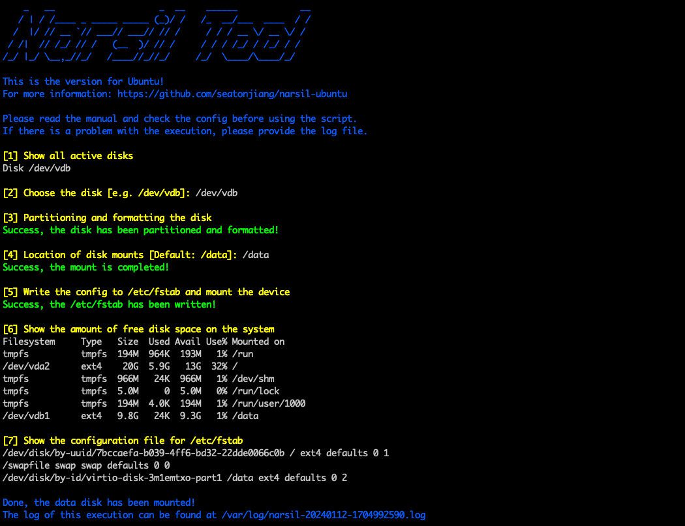

[English](README.md) | **简体中文**

## 💻 工具截图

### 脚本执行


### 登录信息


### 挂载硬盘



## ✨ 工具特性

-   限制密码使用期限为 30 天
-   密码过期 30 天后，该账户将被禁用
-   设置两次修改密码的时间间隔为 1 天
-   在密码过期前 7 天将发出警告
-   将系统默认加密算法设置为 SHA512
-   将会话超时策略设置为 180 秒
-   为新建的用户创建并加入一个同名的组
-   将新建用户的 home 目录权限设置为 0750
-   将存量用户的 home 目录权限设置为 0750
-   强化 OpenSSH 配置（有些配置需要手动配置）
-   禁止没有 home 目录的用户登录
-   禁止新建的用户使用 SHELL 登录
-   禁止上传和用户信息的功能
-   禁止删除用户时同步删除该用户的组

还有很多特性没有被列举出来，可以参考 `scripts` 目录下的文件了解更多信息。

## 🚀 快速入门

### 第一步：克隆仓库

确保服务器安装了 Git，否则需要先安装 `git` 软件：

```bash
git clone https://github.com/seatonjiang/narsil-ubuntu.git
```

如果因为网络问题无法连接，可以使用国内镜像仓库，但是镜像仓库会有 `30` 分钟的延迟：

```bash
git clone https://gitee.com/seatonjiang/narsil-ubuntu.git
```

### 第二步：编辑配置

进入项目文件夹：

```bash
cd narsil-ubuntu/
```

核对配置文件中的配置信息（配置文件说明在下文）：

```bash
vi narsil.conf
```

### 第三步：运行脚本

如果使用 root 账号，可以直接运行，如果是普通账号，需要使用 `sudo` 运行，而且必须用 `bash` 运行该脚本：

```bash
sudo bash narsil.sh
```

## 📝 配置文件

```ini
# 每一项操作完成后进行验证
VERIFY='Y'

# 云服务器使用 Metadata 覆盖默认配置
METADATA='Y'

# 在 banner 中添加生产环境的提示
PROD_TIPS='Y'

# 无响应注销时间 (单位：秒)
LOGOUT_TIME='180'

# SSH 端口配置
SSH_PORT='22'

# 时区配置
TIME_ZONE='Asia/Shanghai'

# 主机名称配置
HOSTNAME='Ubuntu'

# DNS 服务器配置
DNS_SERVER='119.29.29.29 223.5.5.5'

# NTP 服务器配置
NTP_SERVER='ntp1.tencent.com ntp2.tencent.com ntp3.tencent.com ntp4.tencent.com ntp5.tencent.com'

# Docker 配置
DOCKER_CE_REPO='https://mirrors.cloud.tencent.com/docker-ce'
DOCKER_HUB_MIRRORS='https://hub-mirror.c.163.com'
```

## 📂 目录结构

下面是整个项目的文件夹结构，`config` 及 `scripts` 文件夹中的文件省略显示。

```bash
narsil-ubuntu
├── narsil.conf
├── narsil.sh
├── config
│   └── (some config files)
└── scripts
    └── (some script files)
```

## 🔨 独立功能

Narsil 中包含了一些独立的功能，这些功能并不在自动执行的脚本中，需要使用参数单独使用，可以使用 `sudo bash narsil.sh -h` 命令查看所有独立功能。

### 清理垃圾

清理所有的系统日志文件。

> 建议在初始化系统之前先进行清理。

```bash
sudo bash narsil.sh -c
```

### 安装 Docker

安装 Docker 服务并设置镜像加速。

> 安装完成后，可以使用 `docker run hello-world` 测试 Docker 相关功能是否正常。

```bash
sudo bash narsil.sh -d
```

### 挂载硬盘

交互式挂载数据盘，数据无价，操作过程切记小心！

> 如果所选的硬盘已经被挂载，会提示解除挂载及格式化操作，腾讯云会优先使用弹性云硬盘的软链接方式挂载。

```bash
sudo bash narsil.sh -f
```

### 修改主机名称

默认为 `Ubuntu`，如果 `METADATA=Y` 那么默认名称为元数据获取的名称。

> 元数据功能目前仅支持腾讯云服务器。

```bash
sudo bash narsil.sh -n
```

### 修改端口

交互式修改 SSH 端口。

> 端口范围需要在 10000 到 65535 之间。

```bash
sudo bash narsil.sh -p
```

### 卸载监控

卸载服务商安装到服务器中的各种监控组件。

> 此功能目前仅支持腾讯云服务器。

```bash
sudo bash narsil.sh -r
```

### 添加交换空间

如果物理内存太小，建议添加交换空间。

```bash
sudo bash narsil.sh -s
```

## 🤝 参与共建

我们欢迎所有的贡献，你可以将任何想法作为 Pull requests 或 Issues 提交，顺颂商祺！

## 📃 开源许可

项目基于 MIT 许可证发布，详细说明请参阅 [LICENCE](https://github.com/seatonjiang/narsil-ubuntu/blob/main/LICENSE) 文件。
